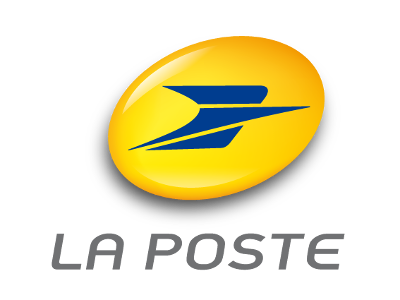

<!--[](http://badge.fury.io/js/laposte-sdk-js)-->
[](https://travis-ci.org/LaPosteApi/laposte-sdk-js)
[](https://coveralls.io/r/LaPosteApi/laposte-sdk-js)

# La Poste Open API SDK JavaScript

[](http://laposte.fr/) 

The official La Poste Open API SDK for JavaScript, supporting browsers and Node.js backends.

More informations about Open API and La Poste (french) : [developer.laposte.fr](http://developer.laposte.fr/)

## Installation

### Node.js

The preferred way to install the La Poste Open API SDK for Node.js is to use the [npm](http://npmjs.org/) package manager for Node.js.

Simply type the following into a terminal window :

```bash
npm install lp-sdk
```

### Browser

The preferred way to install the La Poste Open API SDK for browsers is to use the [bower](http://bower.io/) package manager.

```bash
bower install lp-sdk
```

Alternately, simply add the following script tag to your HTML pages :

#### AMD version

Minified :

```html
<script src="https://raw.githubusercontent.com/LaPosteApi/laposte-sdk-js/master/client/client-lp-sdk.min.js"></script>
```

Non minified :

```html
<script src="https://raw.githubusercontent.com/LaPosteApi/laposte-sdk-js/master/client/client-lp-sdk.js"></script>
```

then :

```html
<script>
var lpSdk = require('lp-sdk')
  , lp = new lpSdk.LaPoste()
  , dgp = new lpSdk.Digiposte();
</script>
```

#### Global version

Minified :

```html
<script src="https://raw.githubusercontent.com/LaPosteApi/laposte-sdk-js/master/client/client-lp-sdk-bootstrap.min.js"></script>
```

Non minified :

```html
<script src="https://raw.githubusercontent.com/LaPosteApi/laposte-sdk-js/master/client/client-lp-sdk-bootstrap.js"></script>
```

then :

```html
<script>
var lp = new lpSdk.LaPoste()
  , dgp = new lpSdk.Digiposte();
</script>
```

## What's provided?

The La Poste Open API developer kit provides some service classes that make API consumption easy.

Available services :

### LaPoste

This is the main service, its main goal is to deal with Open API token.

Have a look at [LaPoste api doc](http://laposteapi.github.io/laposte-sdk-js/classes/LaPoste.html) for more information.

### [Digiposte](http://www.laposte.fr/particulier/produits/presentation/digiposte/vos-donnees-securisees-a-vie)

Digiposte is a safebox web application, and an API provider of the Groupe La Poste.

The Digiposte class exposes all the things you need to consume Digiposte APIs.

Have a look at [Digiposte api doc](http://laposteapi.github.io/laposte-sdk-js/classes/Digiposte.html) for more information.

## Usage

To use an exposed API (by example Digiposte), you first need to authenticate with LaPoste.auth method.

Once you got an access token, you are able to use it with any API provider.

In case of Digiposte, you will need to obtain a second token (the Digiposte one), with Digiposte.auth.

After that you will be able to consume the Digiposte APIs.

Here's an example :

```javascript
var lpSdk = require('lp-sdk')
  , lp = new lpSdk.LaPoste()
  , dgp = new lpSdk.Digiposte();

lp.auth( // Authenticate to La Poste
  {
    consumerKey: 'zzz-eee-rrr-ttt',
    consumerSecret: 'eee-rrr-ttt-yyy',
    username: 'lapostepartner',
    password: 'mysecret'
  })
  .then(function () {
    return dgp.auth({ // Authenticate to Digiposte
      accessToken: lp.accessToken,
      username: 'john',
      password: 'mypassword'
    });
  })
  .then(function () { // Get documents of safebox
    return dgp.getDocs();
  })
  .then(function (docs) { // Now let's play with the collection of documents!
    console.log('docs :', docs);
  })
  .catch(function (err) {
    console.error(err);
  });

```

## API doc

Complete API doc of the SDK : [laposteapi.github.io/laposte-sdk-js](http://laposteapi.github.io/laposte-sdk-js/modules/laPosteSdk.html)

## License

This SDK is distributed under the [MIT License](https://raw.githubusercontent.com/LaPosteApi/laposte-sdk-js/master/LICENSE).

Enjoy !